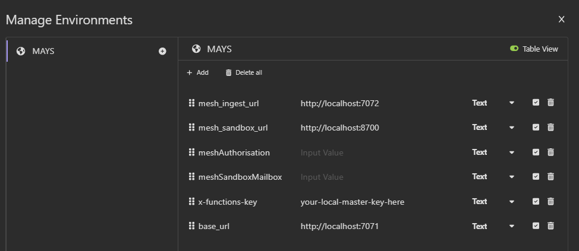

# API Testing with Insomnia

This guide explains how to set up and use the Insomnia collection for testing the local development environment.

## Prerequisites

- [Insomnia](https://insomnia.rest/) installed
- Docker/Podman containers running (`docker-compose up` or `podman-compose up`)

## Setup Instructions

### 1. Import the Insomnia Collection

1. Open Insomnia
2. Click **Create** → **Import From** → **File**
3. Select the `insomnia-collection.json` file from this repository
4. The collection will be imported with all API endpoints

### 2. Get the Azure Functions Master Key

After starting your containers, you need to retrieve your local master key for API authentication:

podman exec -it mesh-ingest cat /azure-functions-host/Secrets/host.json

#### Manual extraction

```bash
podman exec -it mesh-ingest cat /azure-functions-host/Secrets/host.json
```

Look for the `masterKey.value` field in the JSON output.

### 3. Configure the Environment Variable

1. In Insomnia, click on the environment dropdown (usually shows "No Environment") | ctrl/cmd + E
2. Click **Manage Environments**
3. Create a new environment or edit the existing one
4. Add the following variable:

   ```json
   {
     "x_functions_key": "your-local-master-key-here"
   }
   ```

5. Replace `your-master-key-here` with the key you retrieved in step 2

### 4. Environment Variables

The collection uses these environment variables that should be set in Insomnia:

| Variable | Description | Example |
|----------|-------------|---------|
| `x_functions_key` | Azure Functions master key | `your-local-master-key-here` |
| `base_url` | Base URL for API calls | `http://localhost:7071` (adjust port as needed) |
| `mesh_ingest_url` | Mesh ingest service URL | `http://localhost:7072` (adjust port as needed) |



## Usage

1. Start your containers: `docker-compose up` or `podman-compose up`
2. Wait for all services to be healthy
3. Retrieve and set the master key (steps 2-3 above)
4. Use the imported collection to test API endpoints

## Key Persistence

The master key now persists between container restarts thanks to the persistent volume configuration. You only need to retrieve it:

- **First time** after creating the volume
- **After running** `docker-compose down -v` (which removes volumes)
- **After manually deleting** the `mesh-functions-data` volume

## Troubleshooting

### Key Not Found

If you get "no such file" errors, verify the containers are running:
```bash
podman ps
# or
docker ps
```

### Authentication Errors

- Verify the master key is correct and properly set in Insomnia environment
- Check that the `x-functions-key` header is being sent with requests
- Ensure containers are fully started and healthy

### Port Issues

Check your `.env` file for the correct port mappings:

- `API_PORT` - for the main API service
- `MESH_INGEST_PORT` - for the mesh ingest service
